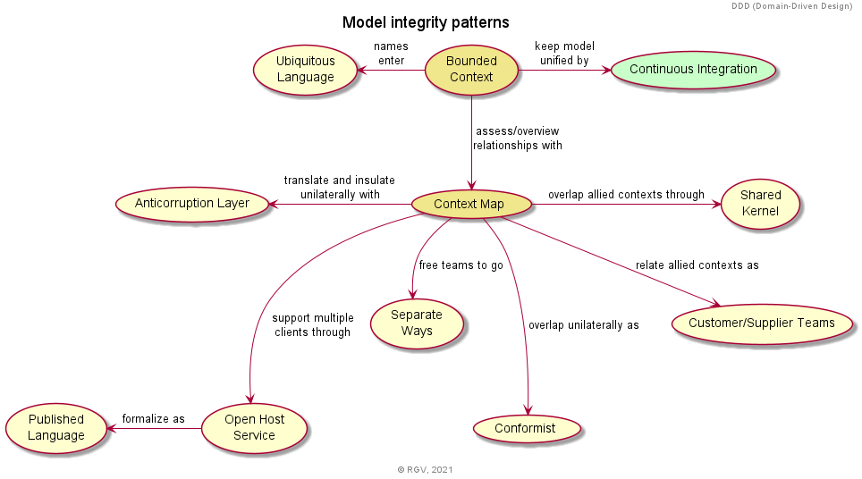
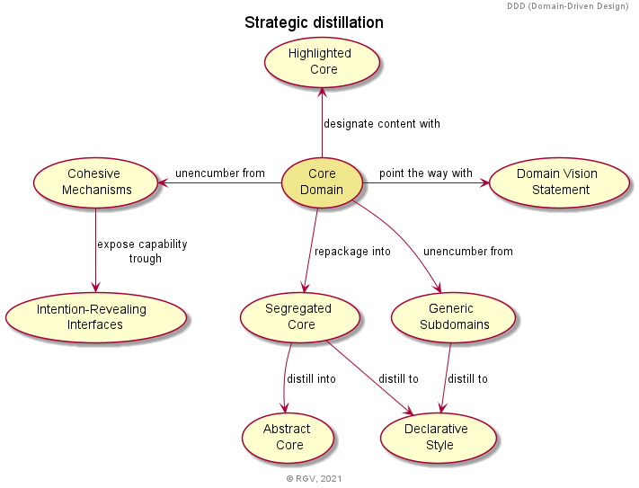
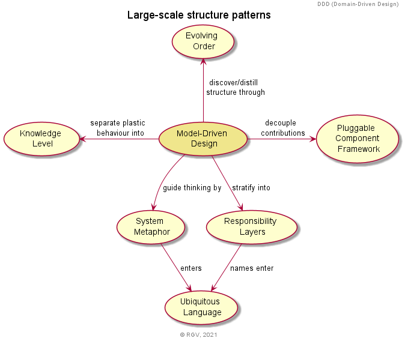

# DomainModelling
A bunch of domain model exercises from any random stuff. Just to practice and improve.

## DDD (Domain-Driven Design)

Some navigation maps shown throughout the book (Eric Evans, 2003).
 
>😅 I used UML Use cases notation as its the closest to original navigation maps diagram notation.

---
_Click diagram titles to expand_.

Model integrity patterns

Strategic distillation

Large-scale structure patterns

