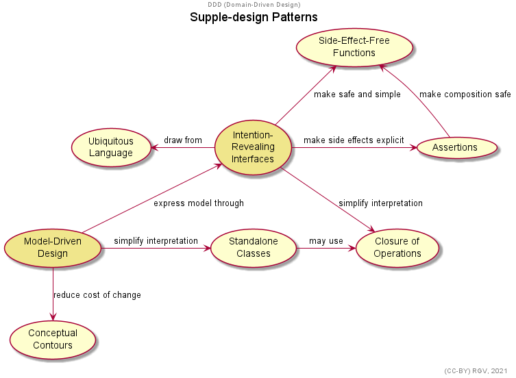
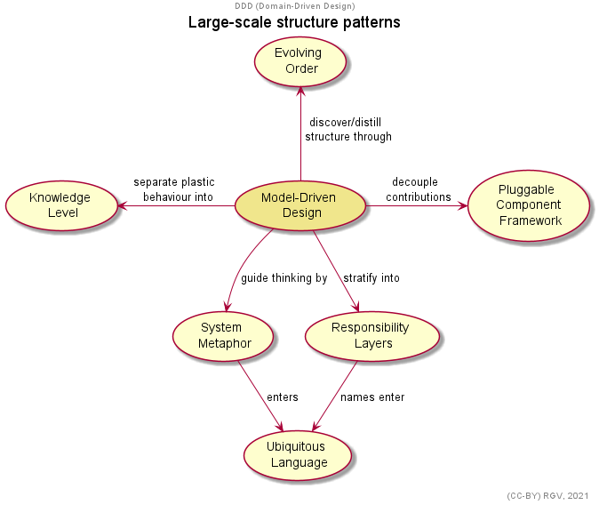

# DomainModelling

A bunch of domain model exercises from any random stuff. Just to practice and improve.
Navigate through folders to see the models.
These are some examples:

## DDD (Domain-Driven Design)

Some navigation maps shown throughout the book (Eric Evans, 2003).

> 😅 I used UML Use cases notation as its the closest to original navigation maps diagram notation.

---

_Click titles to expand diagrams_.

Model-Driven Design

Supple design patterns

Model integrity patterns

Strategic distillation

Large-scale structure patterns

## Pokémon

Some modelling regarding how any Pokémon works within core games series'.

> 🔍 Domain-specific vocabulary selected following Bulbapedia wiki.

---

_Click titles to expand diagrams_.

Pokémon specification

Any Pokémon creature belongs to just one Pokémon species.
So, specie specification is following by all its members.

This is, from a basic point of view, how a specie is defined.

Gender Ratios

Whether a pokémon is genderless, female or male is specified by its specie gender distribution.

Catch Rates

When trying to catch a wild Pokémon, its specie catch rate is just one of many parameters taking account of.
Species' catch rates are specified by a positive number up to 255.

- It is, a Pokémon species with 255 catch rate is at the highest rank likely to be caught.
- Although any specie has its own catch rate, they conform some equivalence classes regarding what “kind of specie” it is, wherein all those species usually share the very same catch rate value.

Base Stats

Any Pokémon grows from a base stats its specie owns.One base stat is a whole number up to 255.

- Only in Generation I, “Special” stat surrounded both attack and defense of special techniques (not-physical ones).
- Throughout Generation II and further, Special split in attack and defense.

Experience groups

These are a tough one.
While the value which better represents a Pokémon growth is its Level, from a design point of view it's not but its total adquired experience.
That is, a concrete Pokémon value is computed from the total experience points it has gained among all its battles.

The way this experience is translated to Pokémon levels comes from a function.
This is where Experience Groups come into play.
Any Experience Group defines the min experience a Pokémon needs to reach any level. To put it another way, the experience group set the lowest value of experience for any Pokémon level.

From Bulbapedia, these three graphs show how each of the six groups are related to level.
(Erratic and Fluctuating were both introduced latter with Generation II).

