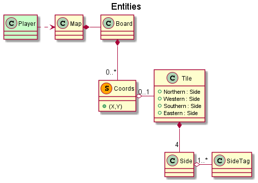

# Kalendra.Carto

👧🗺🧩 Based on Sunhead's Carto map system.

Disclaimer: please do yourself a favor and play Carto.

## How does Carto's map work?

- Map is a tiled board.
- Tiles are squares, then have four sides.
- Any side of a tile has a *type* associated.
  - Types are like sort of biomes if you prefer.
  - Types work slightly different in dungeons — but we don't care here, tho.
  - Do you know [Carcassonne](https://en.wikipedia.org/wiki/Carcassonne_(board_game))? This is much of the same stuff, to sum up.
- A tile can be placed wherever its sides' types respectively match with its neighbours'.
- A tile can be rotated.
- To put tiles covering some requisites generates new tiles in the map.

 <!--GitHub gif views, stored in local, shown in GitHub ReadMe-->

 <!--IDE gif views, through link, not shown in GitHub ReadMe-->

## Proposed Domain Model

This is the sketch-alike first proposal of domain model.
It sure has pitfalls, flaws and misunderstandings.

The way DDD works would guide devs to reshape this very domain model iteratively.
As a matter of training, knowledge-crunching will stand on subsequent diagrams,
hence a comparative would illustrate deviations throughout the whole development,
while a better design emerges from TDD.

## Domain glossary & translation

Tiles:

- Tile: casilla.
- (Tile)Side: lado (de casilla).
- (Side)Tag: tipo/etiqueta de lado (de casilla).

Board:

- Board: tablero.
- Coords: coordenada.
- Map: mapa.

Actions:

- Player: jugador.
- (Player)Actions: acciones (del jugador).
- RotateTile: rotar una casilla.
  - Direction: (en una) dirección.
  - Clockwise: en sentido de las agujas del reloj = dextrógiro.
  - CounterClockwise: en sentido contrario a las agujas del reloj = levógiro.
- PutTile: poner una casilla.
- MoveTile: mover una casilla.
- SpawnTile: crear/generar una casilla.

Missions:

- Mission: misión.
- VictoryMission: misión de victoria.
- MapEnded: mapa acabado.
- MissionPrize: premio de misión.

Requirements:

- (Mission)Requirement: requisito (de misión).
- (Side)TagInAdjacent: tipo de lado adyacente.
- TileInCoords: casilla en coordenada.

Relative:

- Adjacent(Coords): adyacente (una coordenada respecto a otra).
- Neighbour(Tile): vecina (una casilla respecto a otra).
  - AdjacentCoords <-> NeighbourTiles: coordenadas adyacentes <-> casillas vecinas.
- (Requirement)Matches: cumple (los requisitos).

## Domain Iterative Design

