# Kalendra.Inscryption

Modelling Inscryption cards as C# POCOs from Unity Scriptable Objects.

## Domain modelling

### Entities
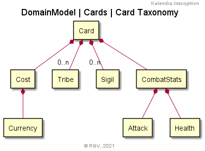  
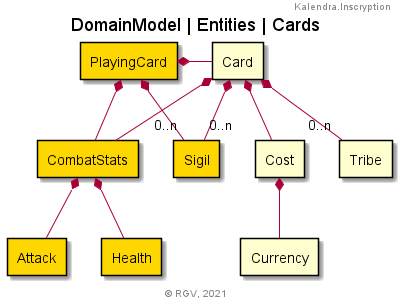  
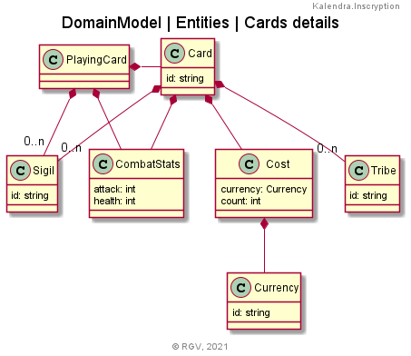

#### Examples
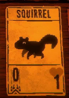
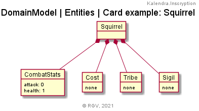

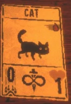
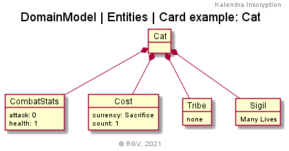

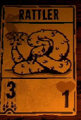
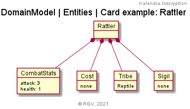

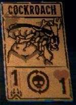
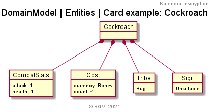

## Analysis

### Entities

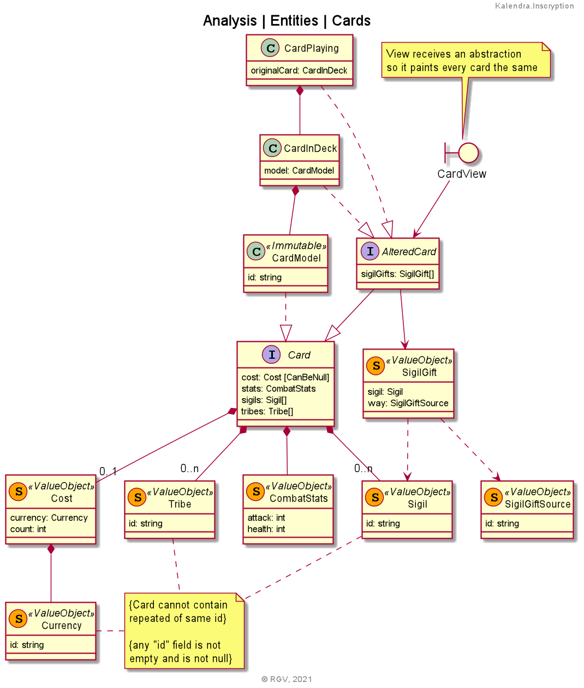

#### Invariants
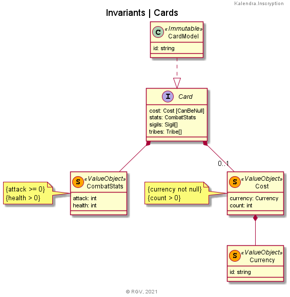
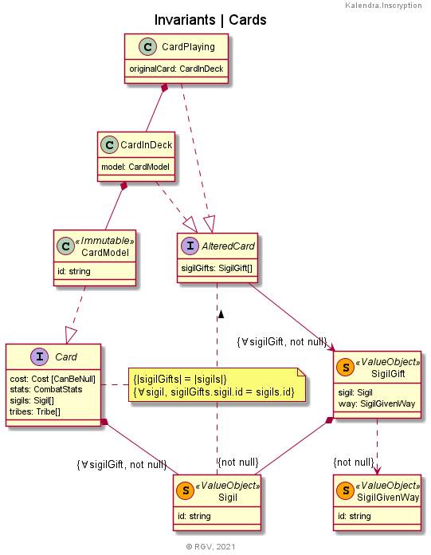
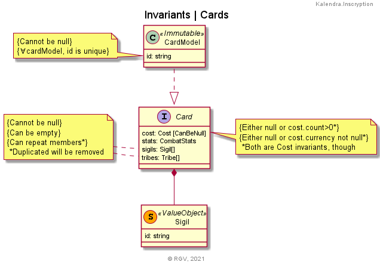

## Design

### Infrastructure/Persistence
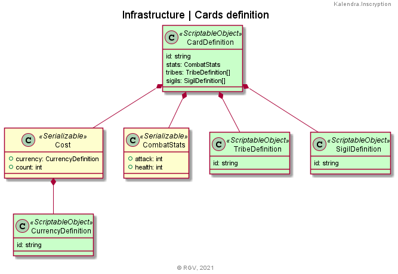

#### Examples
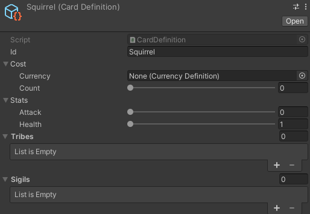
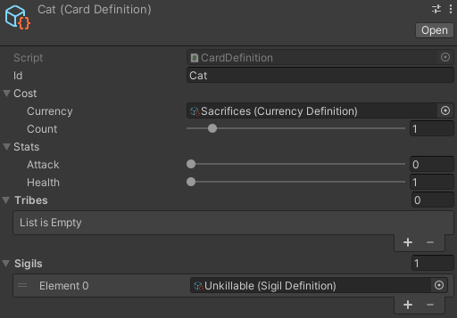
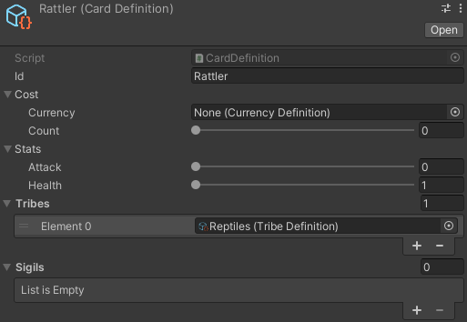
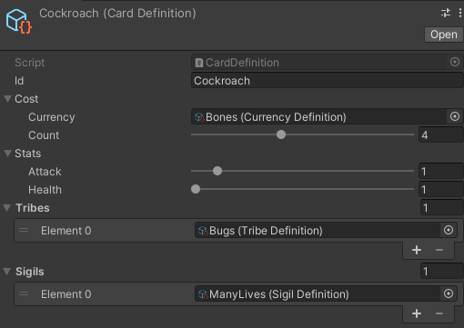

This is just data definition. Sliders on stats don't call for any class invariant.  
It's only offering a handy way to design cards.  
> _However: while its min values are correct, max values of ranges are just dummy. Designers may require higher values to devs anytime, or even force lesser max values. This is Domain bussiness._  

For real class invariants, responsibility is in domain side — over entities whom these definitions are translated to.